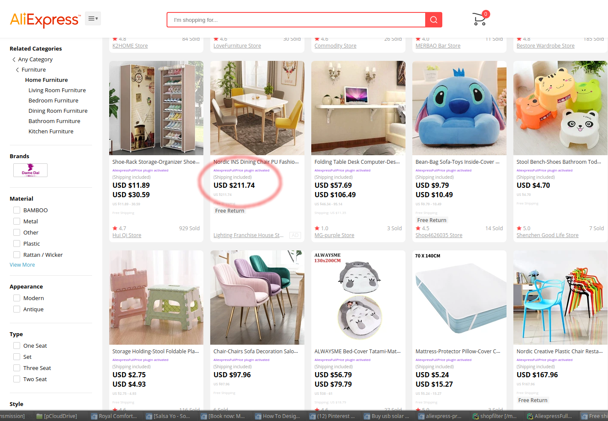
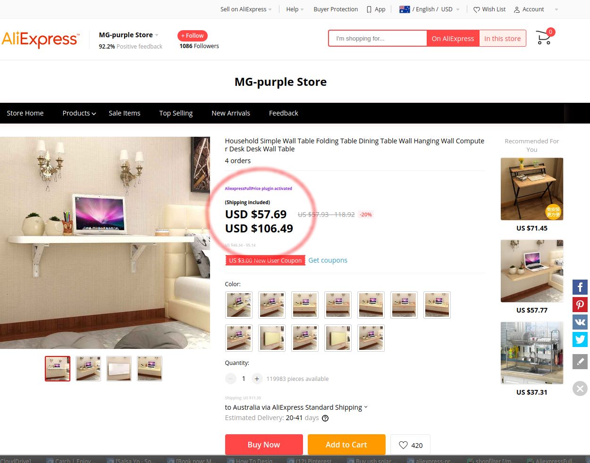
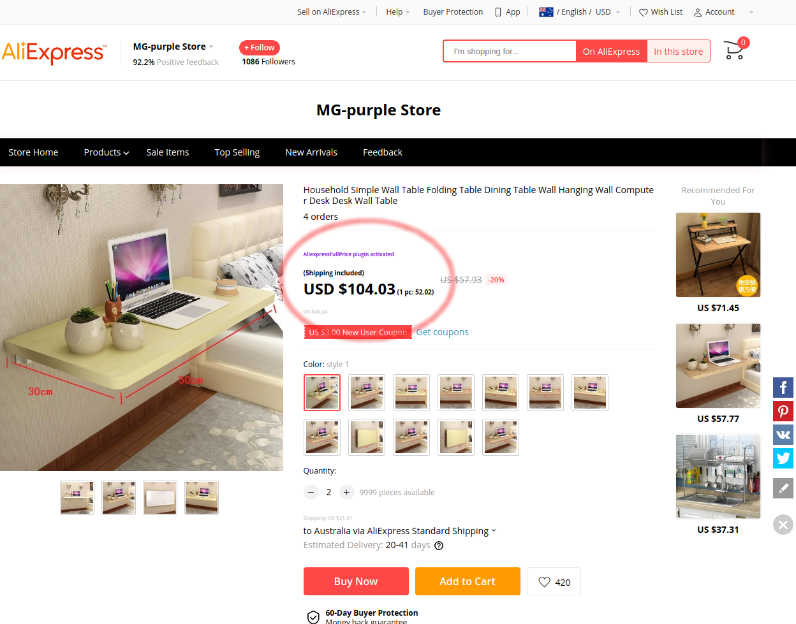
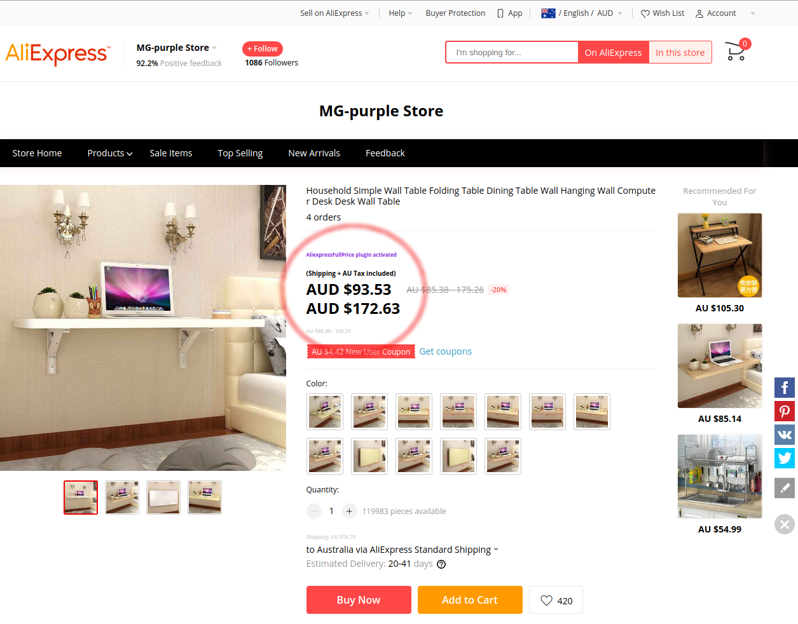

Aliexpress Full Price
=====================

Userscript that calculates the full prices of items in Aliexpress.

To do so, it add the shipping cost and if the currency is Australian Dollar
it also adds a 10% tax to it.

The script works for search results and invidual products.

Examples:
---------

**Product search**

**Product details with multiple prices***

**Product details with single price***

**Product price with Australian taxes***

